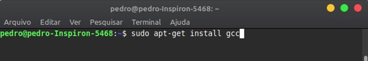
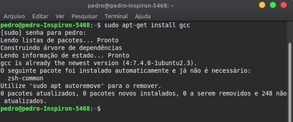
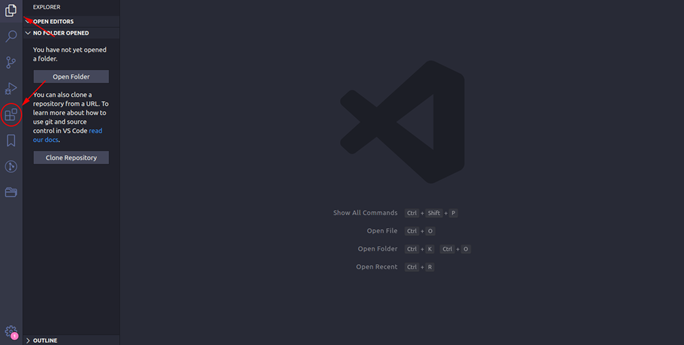
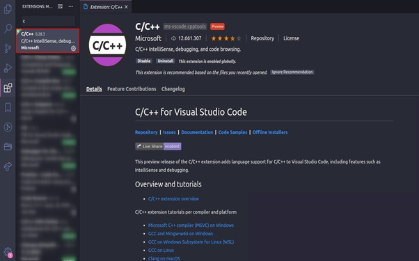

<h1 align=center>Universidade Federal de Viçosa</h1>

<i>Campus</i> Rio Paranaíba  Curso: Sistemas de Informação   Disciplina SIN 494 - Introdução a Programação

 

<h1 align=center> 🧰 Kit de Ferramentas </h1>

<h1 align=center>Autores</h1>

   Carlos Eduardo Maximo - 6962  João Pedro Pereira da Silva - 5199   Pedro Emanuel de Avelar Sousa de Almeida - 6965

  

  

  

  

  
   

 

<h2>1. Introdução</h2>

O trabalho consiste em disponibilizar diversas ferramentas de verificação, conversão
e calculos numéricos, permitindo o usuário selecionar qual ferramenta deseja utilizar atraves de um menu.

  

<ol >
<h2>🛠 Ferramentas do programa: </h2>
<li>
Verifica se o número é primo;
</li>
<li>
Calcula a área de uma figura (funcionando para quadrado, retângulo e triângulo);
</li>
<li>
Calcula o enésimo elemento da sequência de Fibonacci;
</li>
<li>
Calcula o fatorial de um número;
</li>
<li>
Calcula o valor de x elevado a y (xy);
</li>

<li>
Calcula a média de n números inseridos;
</li>
<li>
Calcula máximo divisor comum entre dois números;
</li>
<li>
Uma calculadora com soma, subtração, multiplicação e divisão. Guardando valor  para uma próxima operação;
</li>
<li>
Calcula a diferença entre duas datas em anos, meses e dias;
</li>
<li>
Converta um valor inteiro decimal para número romano;
</li>
<li>
Converta o tempo dado em segundos para horas, minutos e segundos;
</li>
</ol>
 
<h2>2. Compilando</h2>
<h3>2.1. Instalação do compilador GCC em distribuições Linux</h3>

Ubuntu e distribuições debian

 
<ul>
<li>
1 - Abra o terminal <strong>(Ctrl + Alt + T)</strong>.
</li>

<li>
   2 - Para verificar se o <em>gcc</em> esta instalado em seu computador, digite no terminal 
   <em>gcc</em>, caso já esteja instalado irá aparecer a seguinte mensagem “<strong>gcc : fatal error: 
   no input files</strong>”, se não estiver instalado irá aparecer, “<strong>bash: /usr/bin/gcc: Arquivo 
   ou diretorio não encontrado</strong>”.
</li>

<li>
3 - Se nao existir o gcc em seu computador, rode o comando abaixo:
</li>
 

<li>
4 - Apos isso irá aparecer está mensagem, digite sua senha;
</li>
 

<li>
5 - Feito isso a instalação será executada, espere até que finalize.
</li>
 

6 - Pronto gcc instalado.
</li>
 
</ul>

<h2>2.2. Instalação da IDE (Visual Studio Code, Sublime Text, Code Blocks, NetBeans) </h2>

Existem várias IDE’s para programar em C, neste manual iremos ensinar a instalar o 
Vscode, mas fique a vontade para escolher outro.

<ul>
<li>
1 - Abra o navegador e digite vscode, <a href="https://code.visualstudio.com/">Baixar o Vscode</a>.
</li>

<li>
2 - Depois clique em Download, irá baixar o executável em seu computador.
</li>

<li>
3 - Finalizado o Download, abra o arquivo.
</li>

<li>
4 - Clique para instalar.
</li>

<li>
5 - Programa instalado, abra e vá:
</li>  

<li>
6 - Após ter clicado no ícone de extensões digite C.
</li>  
  
<li>
7 - Clique em instalar.
</li>

<li>
   8 - Pronto agora você pode rodar qualquer programa com a extensão arquivo.<strong>c</strong>, 
para compilar os programas, é necessário rodar o comando " <code> <strong>gcc arquivo.c -o arquivo && ./arquivo</strong> </code> " .
</li>
</ul>

 
 
